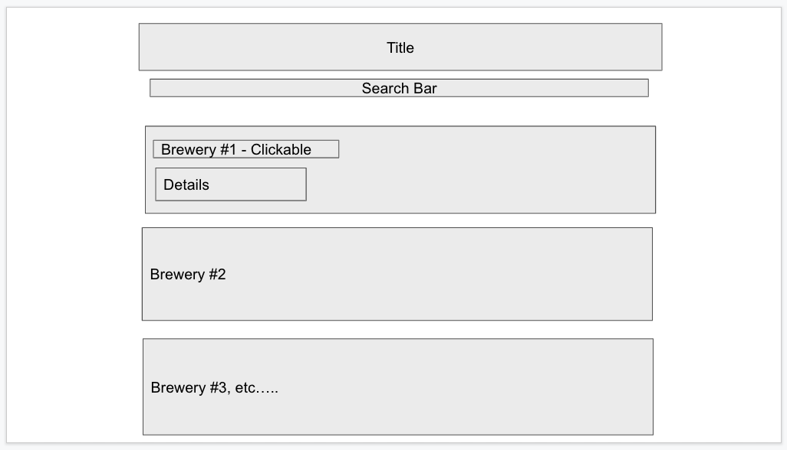

# BREW ME!

****

## Project overview

This application allows users to locate any local breweries given a user input city name. **Brew Me!** should be simple and user friendly; please refer to the following for all project details.

[Project Proposal](./project-proposal.md) : *Includes user story and acceptance criteria*

### Project Members:

* Brandon Maxwell: [brandon-maxwell](https://github.com/brandon-maxwell)
* Felicia Wootton: [fdwootton](https://github.com/fdwootton)
* Pamela Hsu: [p-hsu](https://github.com/p-hsu)

### Project Status:

This application is striclty a MVP with the limited function of searching local breweries by city. The list below mentions future development ideas that could impove upon the simplicity of function as well as UX/UI aspects of **BREW ME!** Please refer to the [**Beyond MVP**](#beyond-mvp) section for details.

#### Issues to debug:
* rending unique info windows for each map markers *(see commented out code at end of `script.js`)*

****

## MVP

### Project-build Aspects:

The following components are used to build the code for this project:

1. **HTML**
2. **CSS**:
    - Bulma
    - Fontawesome
    - custom
3. **JavaScript**:
    - Vanilla JavaScript
4. **API**:
    - [Maps JavaScript API](https://developers.google.com/maps/documentation/javascript/overview)
    - [Open Brewery DB](https://www.openbrewerydb.org/)

### Functionality:

The following lists all functions within this project:

* area for user input to enter and search via city name
* embedded dynamic google maps displaying markers of listed data
    - hovering over markers will show brewery name
* area where results will populate and display the following:
    - brewery name
    - address
    - brewery website if available 
* mobile-friendly with media query technique

### Process:
#### Tasks

Designated tasts and project member initials: see [**Project Members**](#project-members) section for reference
* [x] wireframe: BM/FW/PH
* [x] `project-proposal.md`: BM/FW/PH
* [x] `index.html`: BM/FW
* [x] `style.css`: BM/FW
* [x] `script.js`: BM/FW/PH
    - for loop to render HTML divs: PH/FW
    - details populated from brewery API: BM/FW
    - call Google Maps JavaScript API to render embedded dynamic map: PH
    - functions to render markers/marker clusters for populated data from brewery API: BM
* [x] `README.md`: PH
* [x] API research: BM/FW/PH

### Beyond MVP:

* additional Google Map API functions
    - geolocation
    - distance matrix
* storing user data for other functions
    - ...to save favorite breweries
    - ...to pull into googleMap functions ie. directions 
    - ...to plan a brewery crawl!
* include social networking functions
    - reviews and ratings
    - sharing favorites
* even MORE mobile friendly

****

## Installation

1. Clone this repository onto local workspace
2. Open Terminal (MacOS) or Git Bash (Windows) and change location to where you want the cloned directory
3. Type `git clone` and paste copied respository
4. Directory should include the following:
    * assets folder
        - images folder
        - javascript folder: `script.js`
        - css folder: `style.css`
    * `index.html`
    * `README.md`
    * `.gitignore` file

### Wireframe

### MVP screenshot

****

## Deployment

Please use the following link to deploy a live URL of this project:

[Brew Me!](https://p-hsu.github.io/BREW_ME/)

****

## Credit

* **Brew Me!** original concept and code collaborators: Brandon Maxwell || Felicia Wootton || Pamela Hsu
* Mim Armand and Kat Poulos provided assistance and mentorship as the program instructor and teaching assistant respectivley
* Full-stack Bootcamp Program @ [Washington University, Saint Louis](https://bootcamp.tlcenter.wustl.edu/) through [© 2021 Trilogy Education Services, LLC, a 2U, Inc. brand](https://www.trilogyed.com/)
* [Google Maps API](https://developers.google.com/maps/)
* [Open Brewery DB](https://www.openbrewerydb.org/)
* Animated GIF created using [© Screencastify,LLC 2020](https://www.screencastify.com/)

